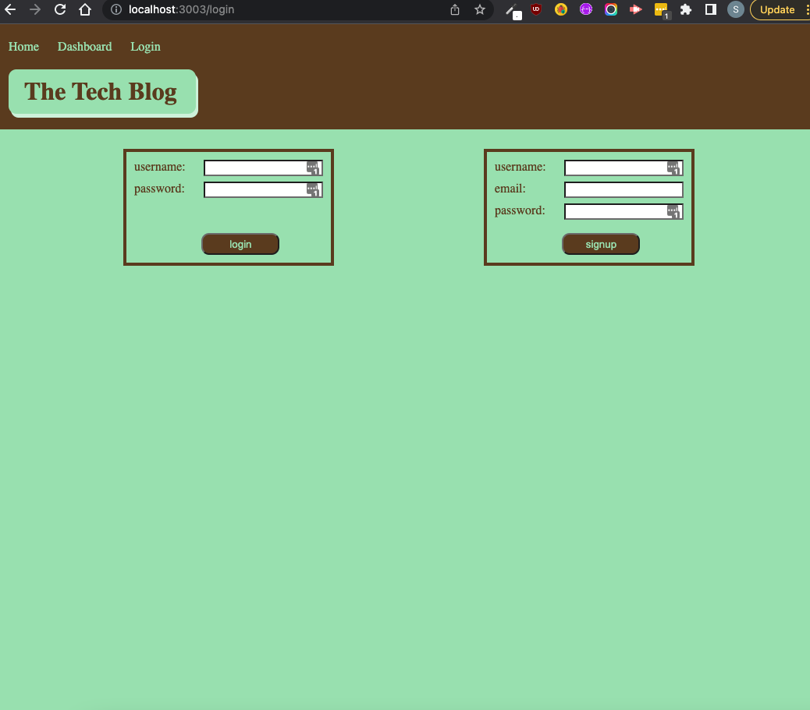
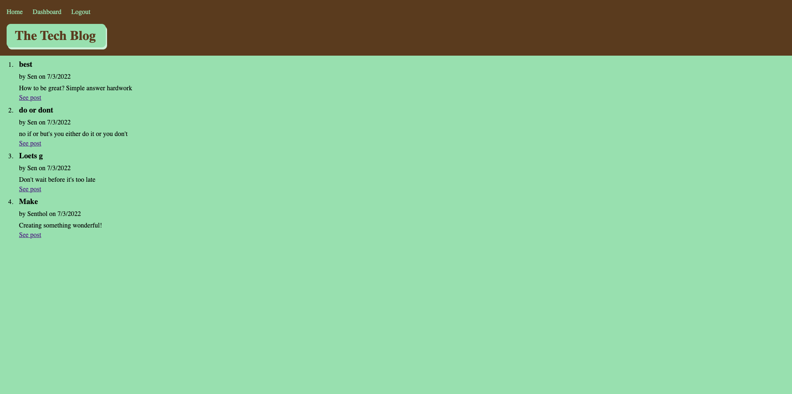

# CMS-Tech-Blog

## Table of Contents

- [Description](#description)
- [Built With](#Built-With)
- [Screenshots](#screenshots)
- [Live Site](#live-site)
- [Setup](#setup)
- [Usage](#usage)
- [Author](#author)
- [Contact](#Contact)

## Description

This website allows developers to write about tech so they can publish articles, blog posts, and thoughts and opinions.

## Built With

The following languages / technologies were used to build this project.

- JavaScript, CSS, ES6, Node, MySql, Handlebars, Sequelize

## Screenshots

- Homepage

* 

- Dashboard

* 

## Live Site

## Setup

Please follow the step by step below to implement this project.

- Step1: Clone the cms-tech-blog repo from https://github.com/katochsenthal/cms-tech-blog to your local computer.  
- Step2: Navigate to the application's root folder.  
- Step3: Type npm init -y.  
- Step4: Type npm install.  

## Usage

Please follow the step by step below to use this application.

From the root of your project, run node server.js, navigate locally to http://localhost:3003 or the live URL at then a sign-in page will be presented, create user or login if you already have an account, create your posts for others to see.

## Author

This application was created by

- Senthol Kumar

## Contact

If you have any question, contact Senthol Kumar

## License

https://api.github.com/licenses/MIT
